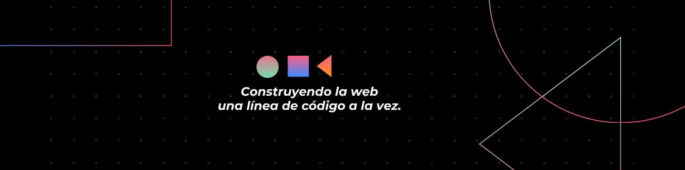

<h1 align="center">
   
  ✨ Bienvenid@ a mi GitHub ✨ 
  
</h1>

  

 

  

 

### 👨‍💻 Sobre mí
* 💻 **Full-Stack Web Developer** en formación.
* 🎓 Estudiante de **Ingeniería de Software**.
* 🚀 Constantemente aprendiendo nuevas tecnologías y enfrentando nuevos retos.
* 🧠 Me encanta crear soluciones digitales y resolver problemas complejos.

---

### 🛠️ Tecnologías y Herramientas

  
  **Lenguajes de Programación**  
  
  
  
  
  
  
     
  **Frontend Web**  
  
  

 

---

### 📱 Conecta conmigo

  
  
  
  
  

